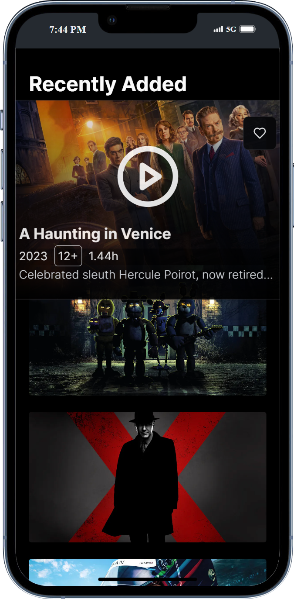

# VINGZFLIX

## Main feature

- Home page with list of latest movies and series
- Movie and series search
- Detail page for each movie or series with more information
- User authentication to mark movies or series as favorites
- User account management

## Technology

- Frontend: Next.js, Tailwind CSS, Shadcn UI
- Backend: Prisma
- Database: Supabase
- Authentication: NextAuth
- Deployment: Vercel

## Setup Proyek

1. Clone repository

```bash
git clone https://github.com/tajulsubqi/Vingzflix-nextJS.git
```

2. Install Dependencies

```bash
cd Vingzflix-nextJS
npm install
```

3. Run Application

```bash
npm run dev
```

## Demo

You can see a demo of this project at [https://vingzflix.vercel.app](https://vingzflix.vercel.app).

## Screenshots

<table>
  <tr>
    <td></td>
   <td></td>
  </tr>
  <tr>
    <td></td>
   <td></td>
  </tr>
  <tr>
    <td></td>
  </tr>

  <tr>
   <td></td>
    <td></td>
  </tr>
  
  <tr>
   <td></td>
  </tr>

</table>

## Feedback

If you have any feedback, please reach out to us at [subqitajul7@gmail.com](mailto:subqitajul7@gmail.com)

## Authors

- [Tajul Subqi](https://github.com/tajulsubqi)
